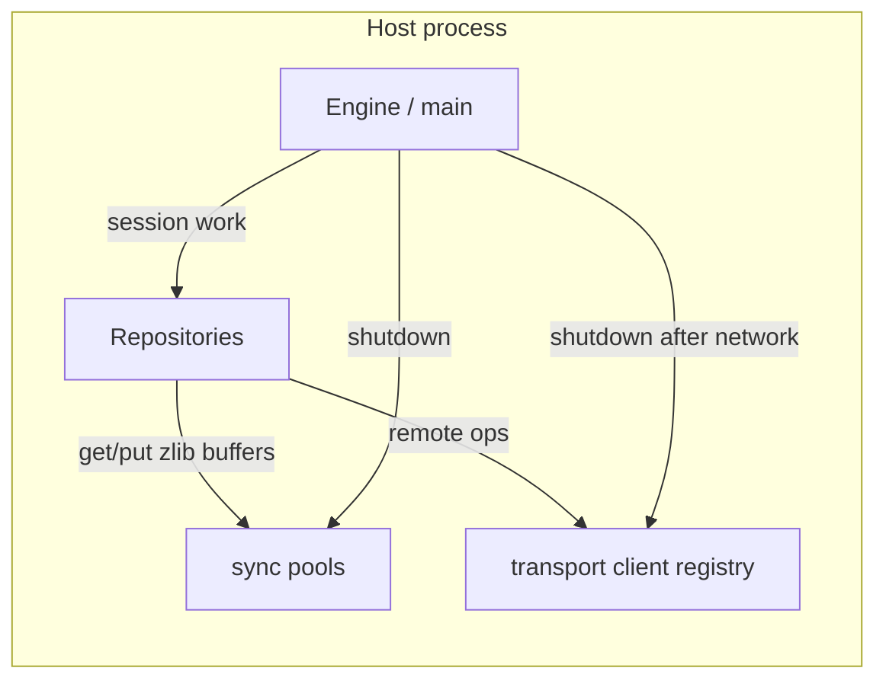
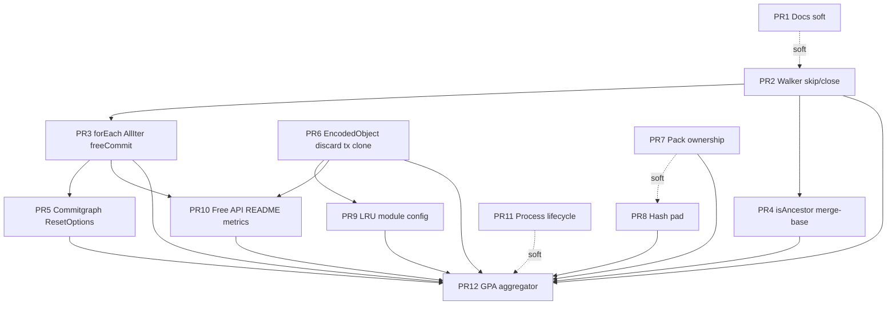

# Gitz Ownership & Feature-Parity Program

| Field | Value |
| --- | --- |
| **Title** | Zig-native ownership contracts for gitz (feature parity without go-git GC assumptions) |
| **Author** | TBD |
| **Date** | 2026-08-12 |
| **Status** | Draft (revised after design review) |
| **Scope** | gitz library itself (not AgentOS host roadmap) |
| **Primary input** | `/mnt/workspace/opytai/AGENTOS_GITZ.md` (audit at gitz `5a9051e0`) |
| **Codebase root** | `/mnt/workspace/opytai/gitz` |
| **Verified against** | gitz commit `5a9051e0e823aaeb942ac0dcf314a8e2f5d6fb26` (matches AGENTOS_GITZ.md pin); spot-checks of walkers, EncodedObject dual contract, `cachePut`, ObjectLru, transactional module/config, README metrics, and wasm pool drains confirmed the design claims |

---

## Overview

Gitz ports go-git into Zig with explicit allocators. Where the port preserved go-git’s “drop the pointer; GC reclaims it” shapes, long-lived and leak-checked hosts observe real leaks, double-frees, and graph identity bugs. The most visible symptoms are commit-walker leaks under production loaders, dual memory/filesystem EncodedObject ownership, dirty Hash pad bytes breaking ancestry maps, pack parser/cache ownership holes, process-global pool/client lifetime, and an asymmetric free API surface.

This design defines a single **ownership program**: go-git remains the **feature and Git-behavior** reference (walk history, pack import, FF checks, store objects, remotes, worktrees), but **not** a lifetime or public free-surface reference. APIs become Zig-idiomatic—single owner, free companions (`freeCommit`, `discardEncodedObject`), free-on-skip + free-on-close walkers, unified EncodedObject contract—even when signatures diverge from go-git. Inventory metrics that score path presence and API-name mimicry are removed from README headlines in favor of correctness, GPA cleanliness, and behavioral goldens.

---

## Background & Motivation

### Current state

go-git assumes a garbage collector. Gitz ports the same graph shapes with `std.mem.Allocator`. The multi-area audit (walkers, storage, cache, pack, protocol, porcelain) confirmed four original themes and many siblings of the same class.

**In-tree good patterns already exist** and prove the intended discipline:

| Pattern | Location | Rule |
| --- | --- | --- |
| `freeReference` + `reference_returns_owned` | `src/storage/{memory,filesystem}/storage.zig`, `RepoStorer` | Backend-aware free; call sites always `defer freeReference` |
| `set_index_takes_ownership` + `util.setIndex` | storage flags + worktree util | Backend-aware index transfer |
| `freeTree` | `src/plumbing/object/tree.zig` | Public free companion for heap `*Tree` (`freeTree(allocator, t)`) |
| `PathIter` / `LimitIter` free skips | `commit_walker.zig` | Free skipped `heap_owned` commits; PathIter frees unyielded on close |
| `CommitParentIter.forEach` | commit parent iteration | `defer deinit+destroy` each parent after use |
| `ObjectIter.forEach` free-after-cb | storer object iterators | Borrow during callback; free after |
| Commitgraph CTime/topo walkers | `commitnode_walker.zig` | Free skipped nodes; drain on close |
| Blame `owned_commits` + arena | `src/blame/root.zig` | Track ownership; arena for temps |
| Revlist / prune | revlist, prune | Arena or per-object `defer deinit` |
| Transactional **memory** object commit clones | `storage/transactional/object.zig` | Both storages own independently (FS tx does **not** yet clone—see WP-B) |

### Pain points (confirmed at `5a9051e0`)

1. **Commit walkers** (`commit_walker.zig`): production loads set `heap_owned = true`; `close` frees parent-hash lists only; seen/filter continues drop loads; `isAncestor` / merge-base never free yields; `CommitIter.forEach` unlike `ObjectIter.forEach`; `AllIter` double-free trap (`freeUnyielded` + `disownTips`).
2. **Hash pad** (`hash.zig`, idxfile): `eql` compares full 32 bytes; partial `@memcpy` into `bytes` and passthrough `cached_hash` can leave dirty pad → false non-ancestors after pack import.
3. **EncodedObject dual contract**: memory caller-owns-until-set vs FS immediately-in-`owned[]` and comments claim “caller retains” after set (false for factory path; bare create+set leaks). Worktree `add.zig` / `commit.zig` `errdefer destroy` is correct only on memory. Transactional **FS** commit passes the same pointer to base without clone.
4. **Pack ownership**: parser map registration vs errdefer (including thin-pack **placeholders**); `Packfile.cachePut` on `found_existing` / zero-hash; OTP `owns_object` flags.
5. **Cache / modules / config**: non-owning `ObjectLru` not scrubbed on FS deinit; transactional `module()` always allocates; FS `config()` re-read UAF; transactional FS `freeReference` is private.
6. **Process globals**: `utils/sync` pools and transport `client` registry live until explicit `deinitPools` / `client.deinit`; wasm examples never call either.
7. **Docs & metrics**: no ownership policy in `ARCHITECTURE.md` / `AGENTS.md` / `docs/TESTING.md`; README status table scores go-git path/API-name parity rather than Zig-safe feature coverage.
8. **ResetOptions.validate** (`worktree/options.zig`): takes `repository.head()` without `freeReference` (AGENTOS priority §8).

### Why feature parity ≠ signature parity

Matching go-git names is useful for navigation. Matching go-git non-frees, dual-backend fuzziness, process-global pools without shutdown hooks, or public APIs that return bare pointers with no free companion **is not**. Those patterns assume GC. Zig needs written ownership rules and GPA tests that enforce them.

---

## Goals & Non-Goals

### Goals

1. **Feature parity** with go-git: history walk, merge-base / ancestor / independents, pack import/export, FF push/fetch/pull, object storage (memory + FS), refs, worktree add/commit, remotes—correct under Zig ownership.
2. **One written ownership contract** for every public API that returns a pointer or owns a graph (who frees, what close frees, backend uniformity or flag+helper).
3. **GPA-clean production paths** under `std.testing.allocator` with real memory and FS storages, production loaders (`heap_owned=true`), early exit, diamond merges, and full deinit.
4. **Symmetric free companions** for graph/storage objects (`freeCommit`, `discardEncodedObject`) with the same discipline as `freeReference` / `freeTree`, including type-erased / facade surfaces.
5. **Hash pad invariant** enforced so map keys and digest display never diverge.
6. **Host/process lifecycle** documentation and hooks: `deinitPools` + transport `client.deinit` after network use; wasm/native examples drain on engine close.
7. **Metric realignment**: README headlines goldens, Bazel gate health, allowlists, and ownership GPA suite counts—not API-name mimicry or path-presence ratios.
8. **Incremental delivery** via ordered, independently mergeable PRs (see ## PR Plan). Each WP PR includes at least one cross-module GPA test where relevant; PR12 aggregates and wires README counts.

### Non-Goals

- Full go-git **signature** or **lifetime** parity (no GC-shaped public APIs).
- Rewriting Git semantics, wire formats, or inventing a non-go-git object model.
- Multi-threaded free lists / ObjectLru locking (remain single-threaded unless a later design).
- Making process pools disappear (keep pools; document and drain at shutdown).
- AgentOS-specific host architecture (only host-visible library contracts that any embedder needs).
- Replacing Bazel inventories entirely in one step (reweight; do not delete all inventory machinery).
- **Parser peak-memory bound** (unbounded parser content cache freed only on `Parser.deinit`) — residual risk accepted for v1; not a WP in this program.
- **Feature coverage checklist as a README metric** — deferred until a schema and Bazel/manual count exist (avoid metric theater). Optional non-metric table may live under ARCHITECTURE later; not a status badge in PR10.

---

## Proposed Design

### Design principle (one sentence)

**go-git is the feature oracle; Zig owns the lifetime contract.**

### Ownership model (canonical rules)

Write once in `docs/OWNERSHIP.md` and link from `ARCHITECTURE.md`, `AGENTS.md`, `docs/TESTING.md`, and `docs/GATES.md` in the same docs PR so no dangling “follow the production ownership contract” phrase remains. Replace every “same as go-git GC” comment with the applicable rule.

#### Rule set

| ID | Rule |
| --- | --- |
| **R1 Caller owns yield** | Iterator `next()` that returns a heap object transfers ownership of that object to the caller when the object is heap-owned. |
| **R2 Free-on-internal-drop** | When an iterator loads an object then skips it (`continue` for seen, seen_external, invalid filter, path/limit skip), it must free that object before continuing. |
| **R3 Free-on-close** | `close` / `deinit` free every remaining **unyielded** heap object still held in stacks, queues, heaps, or path lists. Already-yielded objects are never freed by close (caller owns them). |
| **R4 forEach policy (`*Commit` / ObjectIter)** | Normative for `CommitIter` / concrete commit walkers and `ObjectIter`: **borrow during callback**. Free each yield after the callback returns **including Stop and error paths**, then `close` frees only unyielded remainder. Callbacks must **not** free the yielded object. |
| **R4b CommitNodeIter forEach** | **Same free-after-cb model as R4** for heap-owned nodes (migrate from today’s callback-owns-on-success docs). Always `defer close()`. Grep and fix call sites that retain nodes after a successful callback. |
| **R5 Free companions** | Every public heap return type has a package-level free companion matching in-tree shape (`freeTree(allocator, t)`, `freeReference` backend-aware). Prefer one public symbol; delete private duplicates. |
| **R6 Backend-uniform EncodedObject** | Memory and filesystem share one create/set/lookup/discard contract; transactional commit **clones** (or transfers with remove-from-temporal) so two storages never free the same pointer. |
| **R7 Hash pad invariant** | `Hash.bytes[digestSize()..]` is always zero under the active format. Public construction only via `fromBytes` / `fromHex` / `ZeroHash`. Debug assert in `eql` under safety builds. |
| **R8 Process globals** | Pools and transport registries are process-scoped; hosts must drain them at shutdown with the same allocator used for get/put. Library does not drain on every call or on `Repository.deinit`. |
| **R9 GPA tests gate ownership** | Each WP ends with tests that fail under the old behavior: production loaders, both backends where applicable, early exit, error paths, full deinit, zero leaks, no double-free. Prefer at least one **cross-module** GPA test per WP when the fix spans packages. |

#### R4 forEach algorithm (normative pseudo-code)

```zig
// CommitIter.forEach / forEachCommit — borrow-during-callback
pub fn forEachCommit(iter: anytype, cb: anytype) !void {
    defer iter.close(); // R3: frees only unyielded holds
    while (true) {
        const c = iter.next() catch |err| {
            if (err == error.EndOfStream) return;
            return err;
        };
        // Ownership is with forEach for the duration of the callback.
        var freed = false;
        defer if (!freed) freeCommit(c.allocator, c);
        cb(c) catch |err| {
            // Stop and error both free c via defer, then propagate.
            if (err == error.Stop) return; // success stop after free
            return err;
        };
        freeCommit(c.allocator, c);
        freed = true;
    }
}
```

**Acceptance for PR3:** GPA test where callback returns `error.Stop` after N yields; GPA test where callback returns a random error; both show zero leaks. Grep all `forEach` / `forEachCommit` call sites for callbacks that already free the commit and remove those frees (or document exceptions).

#### Iterator ownership diagram

```mermaid
sequenceDiagram
    participant C as Caller
    participant W as Walker
    participant L as CommitLoader / storer
    participant H as Heap *Commit

    C->>W: next()
    W->>L: get(hash)
    L->>H: create + decode (heap_owned=true)
    alt yield
        W-->>C: *Commit (caller owns)
        Note over W: walker detaches; close must NOT free this pointer
        C->>C: freeCommit(allocator, c) when done
    else skip (seen / filter / path)
        W->>H: freeCommit
        W->>W: continue
    end
    C->>W: close / deinit
    W->>H: free only unyielded on stacks/queues
```

---

### EncodedObject ownership (unified)

**Chosen contract (memory-shaped, FS adapted):**

| Operation | Ownership |
| --- | --- |
| `newEncodedObject` | **Caller owns** until successful `setEncodedObject` **or** `discardEncodedObject`. Neither backend registers in `owned[]` / maps until set succeeds. |
| `setEncodedObject` | Storage **takes ownership** on success (and on go-git-compatible “kept but error” cases where the store retains the object). Caller must not free. On pure pre-insert / pre-write failure, caller retains. |
| `encodedObject` / lookup | Return is a **borrow**; storage owns. Caller must not destroy. |
| `discardEncodedObject(store, obj)` | Safe abandon of a caller-owned create that was never successfully set. Removes from any mid-migration registration then destroy. |
| Storage `deinit` | Frees only objects the storage owns. |

#### Why “set takes ownership” is not optional (FS comment lie)

| Path | Today (FS) | Today (memory) | After unify |
| --- | --- | --- | --- |
| (1) `newEncodedObject` + successful `setEncodedObject` | Object already in `owned[]` from new; set serializes only; comment says “caller retains” but deinit still frees → **caller must not destroy** | Set adopts into maps; caller must not destroy | Storage owns after set; caller must not destroy |
| (2) `newEncodedObject` + error before set | In `owned[]`; bare `destroy` **double-frees** with storage deinit | Caller owns; `destroy` correct | `discardEncodedObject` once |
| (3) bare `allocator.create` + `setEncodedObject` | Set does **not** adopt → **leak** on FS | Set adopts → OK | Set adopts on both → OK |
| (4) `encodedObject` lookup | Borrow; storage owns | Borrow; storage owns | Unchanged borrow |

**Require in PR6:** delete FS “caller retains ownership” comments in the same change that alters registration order / set adoption.

#### FS migration steps

1. Stop appending to `owned[]` in `newEncodedObject`; register only inside successful `setEncodedObject` (or after load paths that create storage-owned clones).
2. For loads (`getFromUnpacked` / pack decode): storage creates, registers in hash-keyed owned map, returns borrow; **dedupe by hash**.
3. Replace every production `errdefer destroy` after `newEncodedObject` with `errdefer store.discardEncodedObject(obj)` (see call-site matrix).
4. Update storer root docs to the unified table.

#### Transactional commit under unified contract (normative — WP-B)

Memory transactional commit already **clones** so base and temporal each own independent `*MemoryObject` values.

Filesystem transactional commit today:

```zig
// Filesystem SetEncodedObject serializes immediately and does
// not retain the pointer. The temporal store keeps ownership.
_ = try self.base.setEncodedObject(obj);
```

After FS `setEncodedObject` **takes ownership**, that pattern is a **double-free** (temporal still owns; base also owns) unless temporal releases the pointer without freeing.

**Normative choice: (a) clone-on-commit for FS transactional objects, matching memory.**

| Step | Behavior |
| --- | --- |
| Temporal `setEncodedObject` | Temporal owns `obj` (same as non-tx FS after unify). |
| `commit()` to base | **Clone** content into a new `*MemoryObject` (or re-read bytes into a fresh object), `base.setEncodedObject(clone)` so base owns the clone; temporal retains/frees its original on temporal deinit/rollback. |
| Rollback / temporal deinit without commit | Temporal frees its owned objects; base never saw them. |
| Capability docs | `set_encoded_object_takes_ownership = true` on memory, FS, and tx wrappers. Generic code must not assume “FS set is serialize-only.” |

**Alternative (b) ownership transfer** (not chosen as default): remove `obj` from temporal owned map without destroy, then `base.setEncodedObject(obj)`. Requires careful rollback if base set fails mid-batch. Clone-on-commit is simpler and already proven in memory tx.

**PR6 must include:** `src/storage/transactional/object.zig`, `src/storage/transactional/filesystem_storage.zig` (and memory tx paths for parity tests), GPA tests for commit success and rollback on **both** memory and FS transactional storages.

#### Capability flags

```zig
/// setEncodedObject takes ownership of the pointer on success (both backends after unify).
pub const set_encoded_object_takes_ownership = true;

/// newEncodedObject registers storage ownership immediately (legacy FS). Must be false after PR6.
pub const new_encoded_object_storage_owned = false;
```

During migration, if FS still registers early, `discardEncodedObject` removes from `owned[]` then destroy.

#### Type-erased / facade free surface (mirror of refs)

Refs were fixed with concrete methods + flags **and** type-erased `RepoStorer` / repository facades. EncodedObject discard must match that discipline—no private helper per package.

| Layer | API |
| --- | --- |
| Concrete storage | `pub fn discardEncodedObject(self: *Self, obj: *MemoryObject) void` on memory `Storage`, FS `Storage(Fs)`, and transactional wrappers (forward to temporal or base object storage as appropriate). |
| Comptime discovery | `@hasDecl` / flag `set_encoded_object_takes_ownership`; discard is always safe to call on a caller-owned create for backends that implement the method. |
| Type-erased `RepoStorer` | Add `discard_encoded_object_fn` (or equivalent) next to `freeReference`, same pattern as `src/plumbing/transport/server/loader.zig`. |
| Repository facade | `PlainRepository.discardEncodedObject`, `Repository(...).discardEncodedObject` re-export next to `freeReference`. |
| Package free-function | Optional `storer.discardEncodedObject(store: anytype, obj: *MemoryObject)` for worktree `anytype` storer, implemented by calling the method. |
| Worktree | Call `w.storer.discardEncodedObject(obj)` (method) so monomorphised storers type-check. |

**Transactional forward:** discard always targets the storage that executed `newEncodedObject` (temporal for tx). Never discard an object after successful set on that storage.

#### Call-site matrix for `newEncodedObject` (PR6 acceptance)

Grep-driven; every site must pair create with successful set **or** discard. Minimum list:

| Site | Action |
| --- | --- |
| `worktree/add.zig` (`copyFileToStorage`) | `errdefer discardEncodedObject` |
| `worktree/commit.zig` (`storeBlob`, commit encode, `buildTreeFromIndex` tree encode) | discard on error; on “object already exists” path that destroys today, use discard |
| `worktree/checkout.zig` helpers that `newEncodedObject` | same |
| `worktree/reset.zig` store helpers | same |
| Pack import / remote pack paths that create then set | memory errdefer destroy stays valid only until unify; switch to discard for portability |
| Transactional object tests | commit + rollback GPA |
| Storage suite | new+discard+deinit; lookup+storage deinit without consumer destroy; both backends |

---

### Commit free companion

Match `freeTree` signature shape; single public symbol; replace private commitgraph helpers.

```zig
/// Free a heap commit from getCommit / walker yield when heap_owned.
/// No-op when heap_owned == false (stack/map test tips).
/// Signature mirrors freeTree(allocator, t).
pub fn freeCommit(allocator: Allocator, c: *Commit) void {
    if (!c.heap_owned) return;
    // Prefer allocator arg for API symmetry with freeTree; assert matches c.allocator in safe builds.
    std.debug.assert(allocator.ptr == c.allocator.ptr);
    c.deinit();
    allocator.destroy(c);
}
```

Export from `plumbing/object` root next to `freeTree`. **PR3** replaces private `freeCommit(allocator, commit)` in `commitnode_object.zig` / `commitnode_graph.zig` and production `deinit+destroy` sites (`remote/refs.zig`, `push.zig`, `worktree/status.zig`, repo log) with this symbol. Walker-internal `freeOwnedCommit` becomes a thin alias or is deleted.

---

### Walker implementation plan (WP-A)

Primary files: `src/plumbing/object/commit_walker.zig`, `merge_base.zig`, consumers in `remote/`, `repo/`, `worktree/`.

| Component | Change |
| --- | --- |
| `PreorderIter` / `PostorderIter` / `BfsIter` / `CTimeIter` / `FilterCommitIter` | On seen/seen_external/invalid continue: `freeCommit` before continue. On `close`: free `start` if still set; drain stack/queue/heap of **unyielded** loaded commits only. |
| `ParentHashIter` | Loads returned to parent walker; parent applies R2/R3. |
| `CommitIter.forEach` / `forEachCommit` | R4 algorithm above (free after cb, free on Stop/error, close unyielded only). |
| `AllIter` | **Single ownership channel (PR3, hard rule):** Tips and walk-loaded commits live only in the path-list structure (or one equivalent list). There is **no** parallel `owned_tips` ownership channel. `next()` transfers ownership of the current path node’s commit to the caller and advances so the node is no longer “held.” `close`/`deinit` free only commits still on the remaining path (`curr` → tail), using `freeCommit` (no-op when `heap_owned=false`). **Delete** `freeUnyielded` and `disownTips` APIs in the same PR as the `repo/log.zig` consumer update—no hybrid reintroduction. |
| `addTip` early break | When common ancestor found: do **not** leak the loaded common commit if not inserted into the path; free remainder of preorder via walk `close` (R3). |
| `isAncestor` / `ancestorsIndex` / `mergeBase*` / `independents*` | Free every non-retained walk yield; **normative return ownership** below (not “document whether”). |
| Commitgraph | See **CommitNode ownership (resolved)** below. |
| `TreeWalker.next` | `errdefer freeTree` before `owned.append` on OOM. |
| `ResetOptions.validate` | `defer repository.freeReference(head_ref)` (or facade equivalent); GPA with FS refs. Owned by **PR5**. |

#### isAncestor / merge-base free-each-yield (PR4)

Close does **not** free already-yielded commits (R3). Every `next()` must be freed by the consumer loop:

```zig
// isAncestorWithLoader — normative
var iter = try newCommitPreorderIterWithLoader(...);
defer iter.deinit(); // frees unyielded only
while (true) {
    const comm = iter.next() catch |err| {
        if (err == error.EndOfStream) break;
        return err;
    };
    if (!comm.hash.eql(self.hash)) {
        freeCommit(allocator, comm); // continue path
        continue;
    }
    freeCommit(allocator, comm); // match/break path — free once, then break
    found = true;
    break;
}
```

**PR4 acceptance matrix:**

| Case | Expect |
| --- | --- |
| Non-match continue (long walk) | Each yield freed; GPA clean |
| Match break early | Last yield freed; close frees unyielded stack; GPA clean |
| Error from next | No extra free of missing yield; close drains; GPA clean |
| Diamond history, production `heap_owned=true` loader | Zero leaks |
| Stack/map loader `heap_owned=false` | freeCommit no-op; still correct |

Same free-on-continue/break pattern for `ancestorsIndex` (every BFS `next()` must be freed; `IsReachable` path frees the matching yield before returning the error).

#### mergeBase / independents return ownership (normative — PR4)

Replace module comments that say results are “borrowed from the walk / input set.” Under production loaders, walker yields are **owned transfers (R1)**. Feature parity still returns commit objects; Zig requires an explicit free contract.

| Phase | Rule |
| --- | --- |
| **During the walk** | `freeCommit(allocator, c)` every `next()` / filter yield that is **not** retained as a result candidate (including filter yields dropped before append, and any temporary loads). |
| **Eliminate candidate** (`independents` `remove`) | If the eliminated pointer is **not** among the original public-API inputs (pointer identity), it was walk-retained → `freeCommit` it. If it **is** an input argument, **never** free it (caller still owns the tip). |
| **Return value** | Caller owns the returned `[]*Commit` **buffer** (`allocator.free(slice)`). Caller owns each **walk-derived** element (`heap_owned` commit retained from a walker, not pointer-equal to an input) and must `freeCommit` each. **Input argument commits are never freed by these APIs** and must not be freeCommit’d *as if the API transferred them* when they appear in the result by alias. |
| **IsReachable short path** | Today returns a one-element slice of input `older`. **Chosen uniform path for GPA:** **clone** `older` into a new heap `*Commit` (`heap_owned=true`), return that pointer in the slice. Caller always `freeCommit`s every result element then frees the slice. Inputs remain solely caller-owned outside the return. (Tests cover both stack-tip and heap-tip roots.) |
| **Public helper (recommended)** | `freeMergeBaseResult(allocator, results: []*Commit)` — freeCommit each element then free slice — safe because IsReachable clones and walk-derived survivors are owned; **independents** that returns only input aliases after filtering must either clone survivors too **or** use `freeIndependentsResult(allocator, results, inputs)` that freeCommits only non-input pointers. **Normative for independents return:** when the returned set is a subset of inputs (common case), return those input pointers and document **caller frees slice only** (elements are borrows of inputs). When mergeBase builds results from walk yields then independents, survivors are walk-derived → caller freeCommits each + free slice. |

**Simplified public contract (what callers memorize):**

```text
mergeBase / mergeBaseWithLoader:
  - API never freeCommits the self/other inputs.
  - During walk: free every non-retained yield.
  - IsReachable: return cloned *Commit in a 1-slice (caller freeCommit + free slice).
  - Normal path: returned elements are walk-derived (after independents); caller freeCommit each, then free slice.
  - GPA: diamond history, production loader, free all results, deinit storages → zero leaks.

independents / independentsWithLoader:
  - API never freeCommits original inputs.
  - Walk yields while testing reachability: freeCommit every yield (none of them are returned).
  - Returned slice is a (possibly empty) subset of input pointers OR newly retained walk commits only if an implementation keeps them — prefer **return input pointers only** (go-git Independents selects from the input set). Caller: free the slice only; do not freeCommit elements (still own tips as before).
  - When mergeBase feeds independents with walk-derived commits (not inputs), those are not "inputs" of independents — freeCommit eliminated ones; survivors returned to mergeBase caller who freeCommits them.
```

**mergeBase → independents ownership handoff:** `mergeBaseWithLoader` builds `res` from filter yields (owned). Pass `res.items` into `independentsWithLoader`. That call’s “inputs” are those walk-derived commits: eliminate → freeCommit; return survivors still owned; mergeBase returns them to the external caller. External caller freeCommits each + free slice. The original `self`/`other` tips are never in that returned set unless IsReachable clone path (clone, not alias).

**PR4 acceptance (additions):**

| Case | Expect |
| --- | --- |
| mergeBase diamond, production `heap_owned=true` loader | freeCommit each result + free slice; storage/walker deinit; GPA clean |
| IsReachable short path (heap tip + stack tip) | result element is clone (`heap_owned`); freeCommit does not free caller tip; GPA clean |
| independents on input-only set | free slice only; tips still usable / freeable by caller once |
| independents eliminate walk-derived (via mergeBase) | eliminated freeCommit’d inside API; no leak |
| Module comments | “borrowed from walk” removed; OWNERSHIP + merge_base.zig state the table above |

Optional micro-opt (hash-only walk / arena) may land later **without** changing this public free contract.

#### CommitNode ownership (resolved — closes former Open Question #1)

| API | Normative rule |
| --- | --- |
| `CommitNode.commit()` | **Always** returns a heap-owned `*Commit` the caller must `freeCommit`. No dual borrow-vs-owned split between object-backed and graph-backed nodes. Implement with load-or-clone as needed so GPA is unambiguous. |
| `CommitNodeIter.forEach` | **R4b:** free-after-cb for heap-owned nodes (migrate away from callback-owns-on-success). Always `defer close()`. Grep call sites in PR5. |
| `CommitNodeIter.close` | Free any internal unyielded holds (walker stacks)—same R3. |
| `ParentCommitNodeIter` | **Invariant:** `next()` loads and returns a node immediately; the iter does **not** buffer a stack of unyielded parents today. Therefore `close` need **not** invent a free stack. Normative: (1) always `defer close()` from forEach; (2) on Stop/error after a successful `next` where ownership was not transferred to the callback under free-after-cb, free that node in forEach (R4b), not in close; (3) if close later gains buffered state, free it—do not add buffers solely to satisfy a vague “free unyielded” line. |

---

### Hash canonicalization (WP-C)

Primary: `src/plumbing/hash.zig`, idxfile encoder/decoder, FS `cached_hash`, transactional clone of `cached_hash`, pack/idx `findOffset` keys if caller hashes are stored.

**Normative `fromBytes` rule:**

```text
fromBytes(raw):
  h = ZeroHash  // all 32 bytes zero
  n = min(raw.len, digestSize())   // active format width, NOT MaxSize
  copy h.bytes[0..n] from raw[0..n]
  // bytes[n..MaxSize] remain zero
  return h
```

Rationale: copying up to `MaxSize` preserves dirty pad when callers pass 32-byte buffers under SHA-1. Truncating to `digestSize()` + zero remainder is the pad invariant. Callers that need full SHA-256 width must set active format (or use format-aware APIs) first.

**Also:**

- Replace idx `@memcpy(hash.bytes[0..oid_len], …)` with `Hash.fromBytes(slice)`.
- `cached_hash = h` → `cached_hash = Hash.fromBytes(h.slice())`.
- Transactional clone of `cached_hash` re-canonicalizes.
- `findOffset` / offset maps: store `Hash.fromBytes(h.slice())`, never raw caller struct with possible dirty pad.
- Safety builds: `eql` / `isZero` call `debugAssertCanonical` (pad zeros beyond `digestSize()`).
- No public `eqlDigest` required if pad is guaranteed.
- Idx checksum temps sized for `digestSize()` / `MaxSize` (SHA-256 readiness).

**Compatibility note:** This **changes** `fromBytes` when `raw.len > digestSize()` (today copies up to MaxSize). Intentional; tests must include dirty 32-byte input under SHA-1 → pad cleared → `eql` matches clean digest.

---

### Pack ownership (WP-D)

| Site | Fix |
| --- | --- |
| `packfile/parser.zig` non-delta | Register in `oi_by_hash` / `oi_by_offset` only after fallible work that would destroy on failure, **or** reverse registration in errdefer (remove map key before destroy). |
| Thin-pack **placeholders** (`external_ref`) | Placeholder `create` + `oi_by_hash.put` before `newDeltaObject`: on failure after put, errdefer must **remove placeholder from map** then destroy, or delay put until placeholder is fully linked. Never destroy a placeholder still keyed in the map. Checklist item in PR7. |
| `packfile.zig` `cachePut` | On `found_existing`: **keep existing, destroy new** (cache owns returned objects). On zero hash: do not insert; destroy new or return error with single owner. Never return an object neither in cache nor owned by caller. |
| `object_to_pack.zig` / delta_selector | `setDelta` owns; `setDeltaBorrowed` does not; document `newDeltaObjectToPack`; GPA both paths. |
| Iterators | `ObjectIterator` / idx iterators: document cache-owned returns; `deinit`/`close` free iterator-local allocations only. |
| objfile Writer | Document abandon-without-close parks zlib window; hosts/tests must close or drain pools. |

**PR7 checklist:** placeholder create/put/remove; `found_existing` free new; zero-hash free/error; OTP setDelta vs borrowed GPA; ObjectIterator deinit docs.

---

### Cache / modules / config (WP-E)

| Issue | Normative fix |
| --- | --- |
| `ObjectLru` non-owning + FS deinit | On destroy of each storage-owned object and on storage `deinit`, call `object_cache.remove(h)` for each owned hash. **Never** `clear()` an external shared LRU when `owns_cache == false` (would drop alternate/parent entries). When `owns_cache == true`, storage may `clear` or deinit the cache it owns after removing entries. GPA: put object in cache, deinit storage, ensure no dangling pointer access. |
| FS `owned[]` growth | Dedupe by hash on load (hash map of owned pointers). |
| Transactional `module(name)` | Cache name → wrapper like base `ModuleStorage.modules`; deinit frees once. |
| FS `config()` re-read | Prefer cache stable `*Config` until setConfig/deinit (memory-like); if re-read kept, document previous pointer invalid. |
| Transactional FS refs | **Public** `freeReference` + `reference_returns_owned` like base FS (today free is private `fn`). |

---

### Free API + docs (WP-F)

| Item | Detail |
| --- | --- |
| `freeCommit(allocator, c)` | Public; matches `freeTree`; replaces private commitgraph helpers |
| `discardEncodedObject` | Concrete + RepoStorer + repository facade (see matrix above) |
| AdvRefs | Document dual rule: session-owned (do not free) vs heap `freeAdvRefs` — table in OWNERSHIP |
| `objectPacks` | Document heap vs empty static return |
| Repository object getters | Free companions next to `freeReference` on facade |
| README metrics | See metrics section; PR10 |

Docs PR1 wording samples (exact intent):

- **AGENTS.md:** Replace “full port of go-git” / unqualified “Port the behavior of go-git” with: “Port go-git **features and Git behavior**. go-git is not a lifetime reference—Zig owns allocation and free companions. See `docs/OWNERSHIP.md`.”
- **TESTING.md:** Replace “Follow the production ownership contract” with a link to OWNERSHIP and require GPA + production loaders.
- **GATES.md:** Inventories are navigation / package-surface hygiene; numeric API-name mapping is **not** a project success metric (align with existing “legacy compatibility data” note).

---

### Process lifecycle (WP-G)

| Item | Action |
| --- | --- |
| `utils/sync.deinitPools` | Document; host/engine close calls with **same allocator** used for get/put |
| Transport `client.deinit` | Same after network use |
| `Repository.deinit` | **Must not** call `deinitPools` (process-global thrash with multi-repo) |
| Wasm examples | Wire drain on engine close for each of: `examples/wasm/engine_smoke.zig`, `local_repo.zig`, `pack_build.zig`, `pack_import.zig`, `persistence.zig` (and `abi.zig` result free remains separate). |
| Wasm GPA note | Freestanding wasm allocators may not enforce leak checks; native GPA tests still require clean drain. Smoke tests document allocator identity. |
| Optional `PoolGuard` | Test helper RAII for suites |



---

## API / Interface Changes

### New / standardized public APIs

```zig
// plumbing/object — next to freeTree
pub fn freeCommit(allocator: Allocator, c: *Commit) void;

// concrete storage + transactional wrappers
pub fn discardEncodedObject(self: *Self, obj: *MemoryObject) void;

// RepoStorer (type-erased) — mirror freeReference
// PlainRepository / Repository facade re-exports next to freeReference
```

### Behavioral / signature changes (intentional)

| API | Before (GC-shaped) | After (Zig) |
| --- | --- | --- |
| Commit walker `close` | Does not free unyielded commits | Frees unyielded heap commits (R3) |
| `CommitIter.forEach` | Yields never freed on success/Stop/error | Free after callback including Stop/error (R4) |
| `CommitNodeIter.forEach` | Callback owns on success; no close | Free-after-cb + `defer close()` (R4b) |
| `CommitNode.commit()` | Dual borrow vs owned | Always owned + `freeCommit` |
| `isAncestor` / merge-base | Leaks under production loaders | Free each yield on continue and break |
| `AllIter` | `freeUnyielded` + `disownTips` + dual tip channel | Single path-list owner; those APIs **deleted** |
| FS `newEncodedObject` / set | Dual lie; no adopt on set | Caller owns until set/discard; set adopts |
| FS transactional commit | Pass pointer without clone | Clone-on-commit like memory |
| Worktree errdefer | `destroy` (FS double-free) | `discardEncodedObject` |
| `ResetOptions.validate` | head ref leak on FS | `freeReference` |
| `Hash.fromBytes` | May copy MaxSize dirty pad | Copy `digestSize()` only; zero pad |
| README metrics | Path + API-name ratios | Goldens + gate + ownership GPA |

### Unchanged (feature surface)

- Observable Git behavior: FF rules, pack wire formats, ref updates, clone/fetch/push semantics (goldens remain).
- go-git package layout and many names (navigable; not a success metric).

---

## Data Model Changes

No on-disk Git format changes. In-memory:

1. **FS ObjectStorage owned:** hash map of owned pointers for dedupe.
2. **Transactional ModuleStorage:** name → wrapper map on both memory and FS tx.
3. **Walker stacks:** free paths only; no new types required for ParentCommitNodeIter.
4. **Hash:** layout unchanged; `fromBytes` semantics change (see WP-C).

---

## Alternatives Considered

### A1. Arena-per-walk only (no free companions)

- **Pros:** simple free. **Cons:** does not fix EncodedObject dual ownership, pack caches, or returned objects. **Decision:** arenas local only (revlist, temps).

### A2. Walker-owns-until-close only

- **Pros:** single free site. **Cons:** breaks retain-across-iteration call sites. **Decision:** reject; use R1+R2+R3.

### A3. Keep FS EncodedObject “caller retains after set”

- **Pros:** less FS churn. **Cons:** permanent footgun; comments already lie. **Decision:** unify memory-shaped.

### A3b. Ownership transfer for FS tx commit instead of clone

- **Pros:** fewer allocations. **Cons:** mid-batch failure / rollback complexity. **Decision:** clone-on-commit (match memory); transfer may be a later optimization with tests.

### A4. Digest-only `eql`

- **Pros:** masks dirty pad. **Cons:** map keys depend on TLS format. **Decision:** full-buffer `eql` + pad zero.

### A5. Signature parity as acceptance metric

- **Pros:** simple number. **Cons:** incentivizes GC-shaped APIs. **Decision:** remove from README; gate ratio non-blocking.

### A6. Keep CommitNode callback-owns-on-success (R4 exception)

- **Pros:** less call-site churn. **Cons:** dual forEach models forever. **Decision:** migrate to R4b free-after-cb for one mental model; PR5 greps call sites.

---

## Security & Privacy Considerations

| Threat | Severity | Mitigation |
| --- | --- | --- |
| UAF / double-free via dual EncodedObject / tx FS commit | **Critical** | Unified contract + clone-on-commit + discard + GPA both backends |
| Parser OOM double-free/UAF including thin-pack placeholders | **Critical** | Register-after-success / reverse errdefer / map remove |
| Dirty Hash pad → wrong ancestry → false FF | **High** | Canonical `fromBytes`; identity tests after pack import |
| ObjectLru dangling after FS deinit | **High** | `remove(h)` per owned hash; never clear external shared LRU |
| Unbounded pack parser content cache | **Medium** | Freed on `Parser.deinit`; **peak-memory bound out of scope for v1** (Non-Goals) |
| Process pool retention | **Low** | Document drain; not confidentiality |
| Hostile repo data | **Existing** | Validate sizes, paths, OIDs, offsets, framing |

---

## Observability

| Signal | How |
| --- | --- |
| Leaks | `std.testing.allocator` / GPA; fail on leak |
| Double-free | Safety builds + GPA; storage deinit after wrong free must not crash after fix |
| Graph identity | Pack-import → parent `Hash.eql` + hex vs raw object text |
| Metrics gate | `//check:metrics` without binding API-name ratio (see below) |
| Host shutdown | Wasm/native examples drain pools (+ client when used) |
| Logging | No production log spam; debug asserts on Hash pad in safe builds |

**Latency:** free-on-skip O(1) per skip; same big-O as today.  
**Storage:** FS owned dedupe reduces duplicate `MemoryObject`s after repeated cache-miss loads.

---

## Rollout Plan

1. **PR1 docs (soft dependency):** OWNERSHIP + AGENTS + TESTING + GATES links. Preferred before code PRs; **not a hard merge blocker** for PR2 if OWNERSHIP rules are copied into the PR2 description temporarily.
2. **WP order** (audit priority):

   | Order | WP | Risk if delayed |
   | --- | --- | --- |
   | 1 | WP-A walkers / isAncestor / merge-base / commitgraph / ResetOptions | FF/push/pull/log correctness + leaks |
   | 2 | WP-B EncodedObject + tx FS commit + worktree | Double-free on FS |
   | 3 | WP-D pack parser / cachePut / OTP / placeholders | OOM UAF on import |
   | 4 | WP-C Hash pad | False graph negatives |
   | 5 | WP-E LRU / module / config / tx freeReference | UAF / leak under modules |
   | 6 | WP-F free API + README metrics | Embedder UX / metrics honesty |
   | 7 | WP-G pools + transport + wasm hooks | Host GPA noise / registry leak |

3. **Per-WP tests:** each PR includes package GPA tests **and** at least one cross-module GPA test when the change spans packages (e.g. walker + remote FF). PR12 **aggregates** and wires README counts—it is not the first time both backends meet walkers.
4. **Feature flags:** not required. Break leaky GC-shaped callers intentionally.
5. **Rollback:** revert single WP PR; no on-disk migration.

---

## README Metrics: Remove, Keep, Replace

Current README “Project status” table:

| Metric (today) | Verdict | Action |
| --- | --- | --- |
| Required go-git package paths 62/62 | Path presence | **Remove from README headline.** Keep `//check:file_inventory` as hygiene. |
| Package API inventories 62/62 valid | File validity | **Remove from README headline.** Keep checker. |
| Explicit API name mappings 571/748 (76.34%) | Signature mimicry | **Remove from README.** |
| Behavioral goldens 81/81 pass | Behavior evidence | **Keep** |
| Bazel acceptance test targets 86/86 pass | Gate health | **Keep** |
| Active compatibility allowlists 0 | Exception hygiene | **Keep** |

### Replacement README status table (PR10 target)

```markdown
| Metric | Current result |
| --- | ---: |
| Behavioral goldens | N / N pass |
| Bazel acceptance test targets | N / N pass |
| Active compatibility allowlists | 0 |
| Ownership GPA suites (memory + FS production loaders) | M / M pass |
```

**No “feature coverage checklist” row** until a schema, owner, and pass/fail definition exist (see Non-Goals). Optional non-metric ARCHITECTURE subsection may list capabilities covered by goldens/named tests without becoming a badge.

### Gate / inventory tooling changes (concrete)

| File | Change |
| --- | --- |
| `README.md` | Replace status table; reword “parity evidence against go-git” → “behavioral goldens vs go-git pin; ownership under Zig contracts” |
| `inventories/metrics.yaml` | Set `api.min_mapped_ratio: 0.0` **or** remove the ratio assertion from `tools/inventory/check_metrics.py` so the gate **cannot** encode signature-parity pressure. Keep pin, package presence, golden min_count, allowlists. Document that mapped-ratio growth is not a roadmap driver. |
| `docs/GATES.md` | Inventories = navigation; numeric API-name fields are legacy / non-blocking |
| `AGENTS.md` | Feature and Git-behavior port; lifetime is Zig-owned; link OWNERSHIP |
| Ownership GPA suites | Named Bazel targets counted for README `M / M` (populated as WP PRs land; PR12 finalizes the set) |

**Note on current gate:** `min_mapped_ratio: 0.5` already fails only on regression below 50%, not on failure to reach 76%. That still encodes signature-parity pressure if someone raises the floor. PR10 sets **0.0** or deletes the check.

---

## Risks

| Risk | Severity | Mitigation |
| --- | --- | --- |
| forEach free-after-cb breaks callers that free inside callback | Medium | Grep call sites; R4 forbids callback free |
| CommitNode R4b migration breaks retain-on-success callers | Medium | PR5 grep + fix; document in OWNERSHIP |
| AllIter log consumer relies on freeUnyielded/disownTips | Medium | PR3 deletes those APIs and updates log.zig in the same change |
| FS EncodedObject + tx commit double-free if clone forgotten | Critical | PR6 tests commit+rollback both backends |
| Hash `fromBytes` digestSize truncate breaks MaxSize callers | Medium | Tests; document format activation |
| Free-on-close double-frees yielded objects | Low | R3: only free still held by walker |
| Scope creep | Medium | PR plan; per-PR acceptance |
| Parser peak memory | Medium | Accepted v1 residual (Non-Goals) |

---

## Open Questions

1. ~~**CommitNode.commit() ownership**~~ — **Resolved:** always heap-owned `*Commit` + `freeCommit`; CommitNodeIter uses R4b free-after-cb. See CommitNode ownership section.
2. ~~**Should `Repository.deinit` call `deinitPools`?**~~ — **Resolved: no.** Host/engine close only.
3. ~~**FEATURE_COVERAGE.md vs ARCHITECTURE**~~ — **Resolved:** no README metric until schema exists; optional ARCHITECTURE subsection later, not PR10 badge.
4. **Freeze vs delete API inventory mapping work?** — **Resolved for gates:** `min_mapped_ratio: 0.0` or remove check; keep inventory files for navigation. Human mapping work may continue but must not drive README.

5. ~~**mergeBase / independents return ownership**~~ — **Resolved:** normative table in Walker plan (walk free non-retained; IsReachable clones; mergeBase returns walk-derived owned results; independents input-subset borrows tips in slice only; eliminate freeCommit for non-inputs).

6. ~~**AllIter tip channel**~~ — **Resolved:** single path-list ownership; delete freeUnyielded/disownTips with log.zig in PR3.

*(No blocking open questions remain for implementation start.)*

---

## Key Decisions

1. **Feature parity, not signature/lifetime parity** — go-git is the feature and Git-behavior oracle; Zig owns lifetime APIs.

2. **Iterator model R1+R2+R3+R4(+R4b)** — caller owns each yield; walker frees skips and unyielded on close; forEach frees after callback including Stop/error for both CommitIter and CommitNodeIter. **AllIter:** single path-list ownership channel only; `freeUnyielded` / `disownTips` deleted with log.zig.

3. **Unified EncodedObject contract (memory-shaped) + clone-on-commit for FS transactional** — caller owns create until set/discard; set takes ownership; lookup borrows; FS tx commit clones like memory so two storages never share one pointer.

4. **Public free companions matching freeTree/freeReference discipline** — `freeCommit(allocator, c)`; `discardEncodedObject` on concrete storage, RepoStorer, and repository facades; one symbol replaces private commitgraph helpers.

5. **Full-buffer Hash.eql + `fromBytes` copies only `digestSize()` then zero pad** — map stability; dirty 32-byte inputs under SHA-1 cannot retain garbage.

6. **Process pools stay process-global; hosts drain at shutdown** — not on `Repository.deinit`; wasm examples named and wired in PR11.

7. **README metrics drop path/API-name parity** — keep goldens, Bazel gate, allowlists; add ownership GPA counts; set `min_mapped_ratio` to `0.0` or remove ratio check; **no** feature-checklist badge until implementable.

8. **Incremental WP-ordered PRs with per-WP GPA (including cross-module)** — PR12 aggregates; soft vs hard deps documented.

9. **Tests must use production loaders and both storages** — stack/map-only tests are insufficient.

10. **Copy in-tree patterns** — `freeReference`, `freeTree`, PathIter, CommitParentIter.forEach, blame, commitnode walkers, memory transactional clone-on-commit (extend to FS tx).

11. **ObjectLru scrub = remove per owned hash; never clear external shared cache** unless `owns_cache`.

12. **ParentCommitNodeIter does not invent an unyielded stack** — free last yield on Stop/error in forEach; close is currently a flag only unless buffers are added later for other reasons.

13. **mergeBase / independents free contract** — free every non-retained walk yield; never freeCommit public inputs inside the API; IsReachable returns a **clone** so callers freeCommit every mergeBase result element uniformly; independents that returns an input subset: free slice only; mergeBase→independents handoff treats walk-derived res as independents “inputs” for eliminate/free rules.

14. **AllIter single path-list channel** — tips and nodes share one structure; `freeUnyielded` / `disownTips` removed in PR3 with `repo/log.zig`; no parallel `owned_tips` ownership.

---

## References

- `/mnt/workspace/opytai/AGENTOS_GITZ.md` — confirmed issues and WP map
- `gitz` @ `5a9051e0e823aaeb942ac0dcf314a8e2f5d6fb26` — verification pin
- `gitz/ARCHITECTURE.md`, `AGENTS.md`, `docs/TESTING.md`, `docs/GATES.md`, `README.md`, `inventories/metrics.yaml`, `GO_GIT_PIN.md`
- Good patterns: storage `freeReference`/flags, `freeTree`, PathIter/LimitIter, CommitParentIter, blame, commitnode walkers, memory transactional clones
- Confirmed gaps: transactional FS non-clone commit, private tx FS freeReference, `ResetOptions.validate`, wasm no `deinitPools`

---

## PR Plan

**Dependency legend:** **Hard** = merge blocker. **Soft** = preferred order only.

| From | To | Kind |
| --- | --- | --- |
| PR1 | PR2–PR11 | Soft (docs preferred first) |
| PR2 | PR3, PR4 | Hard (skip/close free infrastructure) |
| PR3 | PR5, PR10 | Hard for freeCommit symbol; PR5/PR10 need it |
| PR2 | PR4 | Hard; freeCommit public from PR3 is **soft** for PR4 (private freeOwnedCommit acceptable inside PR4 if PR3 not merged—prefer PR3 first) |
| PR6 | PR9, PR10 | Hard for discard + owned map shape |
| PR7 | PR8 | Soft (stronger pack-import identity tests if both land; PR8 can merge alone with unit pad tests) |
| PR2–PR9 | PR12 suite code | Hard |
| PR10 | PR12 README row | Hard if PR12 updates README counts (or split: suite code without README vs README follow-up) |
| PR11 | PR12 | Soft (suite may assert deinitPools in native tests independently) |

### PR1 — Ownership contract docs (foundation)

- **Title:** `docs: define Zig ownership contract; de-emphasize go-git lifetime parity`
- **Files/components:** `docs/OWNERSHIP.md` (new), `ARCHITECTURE.md` (link), `AGENTS.md` (exact wording: feature/Git-behavior port; Zig owns lifetimes), `docs/TESTING.md` (link OWNERSHIP; require GPA + production loaders), `docs/GATES.md` (inventories navigation-only; API-name ratio not success)
- **Dependencies:** none
- **Hard/soft:** Soft predecessor of all code PRs
- **Description:** Write R1–R9, R4 algorithm, EncodedObject table, CommitNode rules, process lifecycle. No production code required.

### PR2 — WP-A1: Commit walker free-on-skip + free-on-close

- **Title:** `object: free heap commits on walker skip and close`
- **Files/components:** `src/plumbing/object/commit_walker.zig` (Preorder/Postorder/Bfs/CTime/Filter), production-loader unit tests
- **Dependencies:** PR1 soft
- **Description:** R2/R3 on core walkers; free on seen/seen_external/invalid continues; drain unyielded on close; GPA early exit + diamond. Include one cross-module note if a remote test is cheap; otherwise package-level GPA with production loader is mandatory.

### PR3 — WP-A2: forEach, AllIter single-owner, freeCommit

- **Title:** `object: CommitIter forEach free-after-cb; AllIter single owner; freeCommit`
- **Files/components:** `commit_walker.zig` (forEach algorithm with Stop/error free), AllIter path-list-only ownership, **delete** `freeUnyielded` / `disownTips`, `plumbing/object` export `freeCommit(allocator, c)`, replace private commitgraph free helpers, `src/repo/log.zig` (same PR)
- **Dependencies:** PR2 hard
- **Description:** R4 algorithm; grep forEach call sites; **hard AllIter rule:** tips inserted only into the path structure; `next()` transfers and detaches; `close`/`deinit` frees only remaining path commits; no `owned_tips` second channel; delete freeUnyielded/disownTips with log.zig update; public freeCommit matching freeTree; GPA Stop/error forEach paths + AllIter early close.

### PR4 — WP-A3: isAncestor / merge-base / consumers

- **Title:** `object: free commits in isAncestor, merge-base, and remote FF paths`
- **Files/components:** `merge_base.zig` (ownership docs + walk free + IsReachable clone + independents eliminate free); audit `remote/refs.zig`, `fetch.zig`, `push.zig`, `worktree/pull.zig`, `repo/repository.zig`, `repo/facade.zig`; optional `freeMergeBaseResult` helper next to freeCommit
- **Dependencies:** PR2 hard; PR3 soft (prefer public freeCommit)
- **Description:** Free on continue and break for isAncestor/ancestorsIndex; **normative mergeBase/independents return table** (walk free non-retained; IsReachable clone; mergeBase results walk-derived + caller freeCommit each; independents input-subset → free slice only; freeCommit eliminated walk-derived); remove “borrowed from walk” comments; acceptance matrices (isAncestor + merge-base diamond/IsReachable/independents); production loader GPA; cross-module FF path test preferred.

### PR5 — WP-A4: Commitgraph + TreeWalker + ResetOptions.validate

- **Title:** `object: commitnode R4b forEach; always-owned commit(); TreeWalker errdefer; ResetOptions freeReference`
- **Files/components:** `commitgraph/commitnode.zig`, `commitnode_walker.zig`, `tree.zig`, `src/worktree/options.zig` (`ResetOptions.validate`), GPA with FS refs
- **Dependencies:** PR3 hard (`freeCommit`)
- **Description:** Migrate CommitNodeIter forEach to free-after-cb + `defer close()`; `CommitNode.commit()` always owned; ParentCommitNodeIter invariant (no invented stack); TreeWalker `errdefer freeTree`; `defer freeReference` on head in validate; grep CommitNode forEach call sites.

### PR6 — WP-B: EncodedObject unified contract + discard + transactional FS clone

- **Title:** `storage: unify EncodedObject ownership; discardEncodedObject; FS tx clone-on-commit`
- **Files/components:** `storage/memory/object.zig`, `storage/filesystem/object.zig`, `storage/transactional/object.zig`, `storage/transactional/filesystem_storage.zig`, `plumbing/storer`, `RepoStorer` / repository facade discard methods, `worktree/add.zig`, `commit.zig`, `checkout.zig`, `reset.zig` (grep matrix), storage suite
- **Dependencies:** none hard (parallel with WP-A)
- **Description:** Caller owns until set; set adopts both backends; delete FS “caller retains” comments; discard on concrete + type-erased + facade; FS transactional **clone-on-commit**; call-site matrix complete; GPA new+discard, lookup+deinit, commit+rollback memory and FS.

### PR7 — WP-D: Pack parser, cachePut, OTP, thin-pack placeholders

- **Title:** `packfile: parser map/placeholder errdefer; cachePut ownership; OTP delta flags`
- **Files/components:** `packfile/parser.zig`, `packfile.zig`, `object_to_pack.zig`, delta_selector as needed
- **Dependencies:** none hard (parallel)
- **Description:** PR7 checklist (placeholders, found_existing, zero-hash, OTP, ObjectIterator docs); GPA OOM/error paths.

### PR8 — WP-C: Hash pad canonicalization

- **Title:** `plumbing: Hash.fromBytes digests only active width; pad zero invariant`
- **Files/components:** `hash.zig`, idxfile encode/decode, FS `cached_hash`, transactional hash clone, `findOffset`/map key sites
- **Dependencies:** PR7 soft (pack-import eql tests stronger after PR7)
- **Description:** Normative fromBytes; site list; dirty 32-byte SHA-1 input test; debug assert in eql.

### PR9 — WP-E: ObjectLru scrub, module cache, config, tx freeReference

- **Title:** `storage: ObjectLru remove-on-deinit; module name cache; config lifetime; tx freeReference`
- **Files/components:** FS object, ObjectLru, transactional storage + filesystem_storage, config
- **Dependencies:** PR6 hard preferred (owned map + ownership flags)
- **Description:** remove(h) only on shared cache; module map; config cache or docs; public freeReference on tx FS; GPA dangling cache test.

### PR10 — WP-F: Free API surface + README metrics realignment

- **Title:** `docs+api: free companions complete; README drops API-name parity metrics`
- **Files/components:** `README.md`, `inventories/metrics.yaml` and/or `check_metrics.py` (`min_mapped_ratio: 0.0` or remove ratio check), residual AdvRefs/objectPacks docs, facade exports if not in PR6
- **Dependencies:** PR3 hard, PR6 hard
- **Description:** Complete free surface; rewrite README table (no path counts, no 571/748, no feature-checklist row); gate cannot enforce signature-parity ratio.

### PR11 — WP-G: Process lifecycle hooks and examples

- **Title:** `sync+transport: wire deinitPools and client.deinit on wasm/native host close`
- **Files/components:** `utils/sync` docs, transport client docs, `examples/wasm/engine_smoke.zig`, `local_repo.zig`, `pack_build.zig`, `pack_import.zig`, `persistence.zig`, optional PoolGuard
- **Dependencies:** none hard; README cross-link soft after PR10
- **Description:** Each wasm engine close path drains pools with matching allocator; document wasm vs native GPA; client.deinit after network examples/tests.

### PR12 — Ownership GPA meta-suite (aggregator)

- **Title:** `test: aggregate ownership GPA suite; README ownership counts`
- **Files/components:** integration/ownership tests spanning walker+FF+EncodedObject+pack identity+pools; BUILD.bazel; README `M / M` row (requires PR10 table shape)
- **Dependencies:** PR2–PR9 hard for suite completeness; PR10 hard for README row (split allowed: land suite target first, README count in tiny follow-up)
- **Description:** Aggregates per-WP tests into a visible acceptance suite; does not introduce the first dual-backend walker test (those land earlier). Zero leaks end-to-end.



**Parallelism:** After PR1 (soft), PR6 / PR7 / PR8 / PR11 run in parallel with the walker chain PR2–PR5.

---

## Acceptance criteria (program complete)

1. Under `std.testing.allocator`, production heap loaders, memory **and** FS storage: history walk early exit, diamond merge, isAncestor, merge-base (including freeCommit of walk-derived results / IsReachable clone), independents, worktree add/commit, pack import, transactional commit/rollback—**zero leaks, no double-free**.
2. EncodedObject create/set/lookup/discard identical ownership rules on both backends; FS tx clone-on-commit.
3. `Hash.eql` never diverges from digest hex due to pad garbage on public construction paths (`fromBytes` active-width only).
4. Public free companions: `freeCommit(allocator, c)`, `discardEncodedObject` on concrete + RepoStorer + repository facade; OWNERSHIP docs define R1–R9 and CommitNode rules.
5. README headlines goldens, Bazel gate, allowlists, ownership GPA—**not** path counts or API-name mapping ratios; `min_mapped_ratio` is 0.0 or unchecked.
6. Named wasm examples drain pools (and transport client when used) on engine close; allocator identity documented.
7. No module comments that justify leaks as “same as go-git GC” for open walks; FS “caller retains” EncodedObject comments removed.
8. `ResetOptions.validate` frees head refs; ParentCommitNodeIter/forEach ownership unambiguous under R4b.
